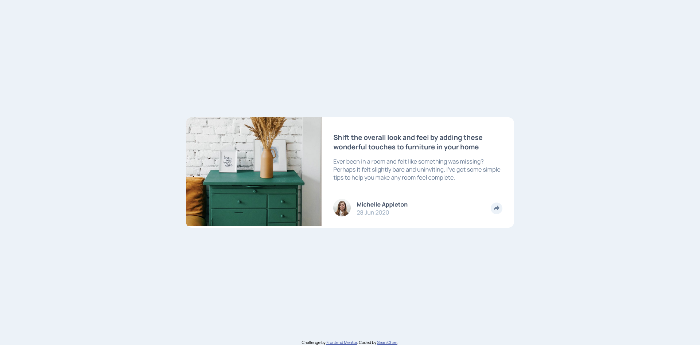

# Frontend Mentor - Article preview component solution

This is a solution to the [Article preview component challenge on Frontend Mentor](https://www.frontendmentor.io/challenges/article-preview-component-dYBN_pYFT). Frontend Mentor challenges help you improve your coding skills by building realistic projects. 

## Table of contents

- [Overview](#overview)
  - [The challenge](#the-challenge)
  - [Screenshot](#screenshot)
  - [Links](#links)
- [My process](#my-process)
  - [Built with](#built-with)
  - [What I learned](#what-i-learned)
  - [Continued development](#continued-development)
- [Author](#author)

## Overview

### The challenge

Users should be able to:

- View the optimal layout for the component depending on their device's screen size
- See the social media share links when they click the share icon

### Screenshot

### Links

- Solution URL: [Solution](https://github.com/chenmeister/article-preview-component)
- Live Site URL: [Live Site](https://chenmeister.github.io/article-preview-component/)

## My process

### Built with

- Semantic HTML5 markup
- CSS custom properties
- Flexbox
- CSS Grid
- Mobile-first workflow

### What I learned

To leverage JavaScript for setting the `.active` class to display the social media tooltips. 

### Continued development

I plan on refining this project more by having the social media tooltip to display above the share icon when clicked. I am having some trouble getting it to display properly. Any pointers would be greatly appreciated.

## Author

- Website - [Sean Chen](https://chenmeister.github.io/)
- Frontend Mentor - [@chenmeister](https://www.frontendmentor.io/profile/chenmeister)
